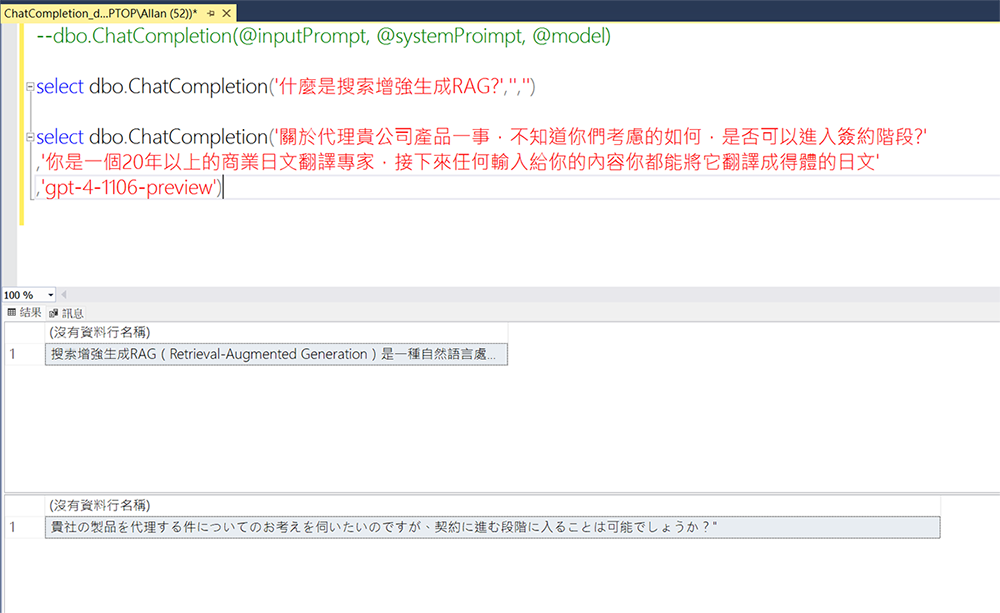

# SQLRAG
## 讓SQL Server也能執行向量相似性查詢

目前已經實現功能:  
- 各種相似性比較CLR函數: CosineSimilarity, EuclideanDistance...  [參考 (https://chat.openai.com/share/40723def-afdd-4f83-adb3-fbcae34b617a)]
- 透過CLR函數調用Openai API(GetEmbedding, ChatCompletion...) 

## 安裝
1. 首先要啟用SQL Server CLR:
'''
	sp_configure 'show advanced options', 1;  
	RECONFIGURE;  
	sp_configure 'clr enabled', 1;  
	RECONFIGURE;  
'''

2. 如果要使用OpenaiFunction，請於OpenaiFunction.cs中輸入你實際的OPENAI_API_KEY
3. 建置專案，發行至指定資料庫 (專案中的SQLRAG.publish.xml為發行設定檔範例，請改指向至你實際的資料庫，在assets中有SqlRAG資料庫的備份可以直接還原)
4. assets中的QueryIntentCache_demo.sql (語意快取範例)以及ChatCompletion_demo.sql(ChatGPT回答範例)

